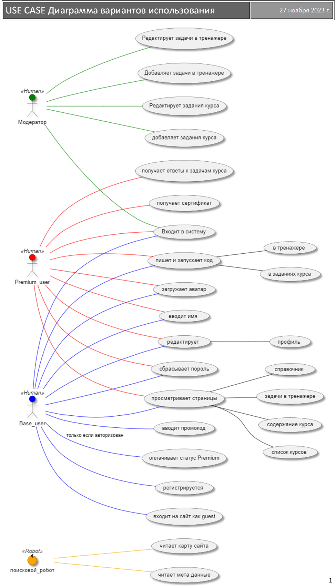

<h1 id="Спецификация требований к програмному обеспечению BIWOL">Частичная демонстрация спецификации требований к програмному обеспечению BIWOLTM website</h1>
<h3 id="Выполнил: Буров А.Е."> Выполнил: Буров А.Е</h3>
<h2 id="1-общие-сведения">1. Общие сведения</h2>
<h3 id="1.1. Назначение документа">1.1. Назначение документа</h3>

Целью этого документа является описание требований к веб-сайту интерактивных онлайн-курсов. Этот документ сопровождает код и устанавливает, что веб-сайт должен делать и каковы приемлемые характеристики еге реализации. Документ подробно описывает, как должен себя вести код. Спецификация понятным и недвусмысленным образом охватывает все области поведения системы. Этот документ никогда не является окончательным и исчерпывающим. При разработке этого документа следует придерживаться основополагающих принципов Agile-разработки. Он дорабатывается непрерывно на протяжении всего последующего жизненного цикла проекта и фиксирует достигнутые договоренности вовлеченных сторон на момент сохранения документа в репозитории кода.

<h3 id = "Предполагаемая аудитория и предполагаемое использование документа">1.2. Предполагаемая аудитория и предполагаемое использование документа</h3>

Этот документ полезен для группы разработки веб-сайта (включая разработчиков, тестировщиков и менеджеров проектов), заинтересованных сторон в других отделах, включая отдел контроля качества, группы руководителей, отдел продаж и маркетинга.

<h3 id = "Прикладная область и назначение системы">1.3. Прикладная область и назначение системы</h3>

- Сисиема должна представлять из себя комплекс олайн-курсов, которые составляют автоматизированную систему (далее - Программа) и предоставляют сервис интерактивных онлайн-курсов с упражнениями и заданиями для начинающих; 
- Клиентская часть программы должна быть реализована в качестве веб-сайта. Сайт, включая страницы, сообщения на Email, всплывающие окна должны быть выполнены в общем стиле и эргономичны; 
- Сервис должен позволять пользователям получать базовые знания и навыки для написания и/или эксплуатации компьютерных программ в режиме интерактивного самообучения;

 У программы должны быть несколько ролей:

- Модератор
- Обычный пользователь 
- Премиум пользователь 
- Поисковой робот

 Для сохранения прогресса обучения и получания премиум статуса каждому пользователю  требуется учетная запись зарегистрированная в программе.

Программа должна обеспечивать хранение пользовательских данных. Прграмма не предназначена для сбора, хранения и предачи конфиденциальных данных.

<table>
     <th style="text-align:left;min-width:300 px;width:25 %"> <a id = "1.3.-use case"href="#">1.3.-use case</a>
     </th>       
</table> 
 
</td> 

<h3 id = "1.4. Определения и сокращения"> 1.4. Определения и сокращения</h3>
<ul>
<li>Прграмма - Система компании BIWOLTM</li>
<li>SQL - Structured Query Language — «язык структурированных запросов»</li>
<li>SRS - software requirements specification (структурированный набор требований)</li>
</ul>
<h2 id = "1.5. Ссылки">1.5. Ссылки</h2>
<ul>
<li>
<a title = "Главный сайт компании BIWOL">biwol.ru</a> - главный сайт компании BIWOLTM;
</li> 
<li>
<a href = "http://agilemanifesto.org/iso/ru/manifesto.html" title = "Manifesto for Agile Software Development">Манифест</a> - при разработке данного документа следует придерживаться основополагающих принципов Agile-разработки;
</li>
<li>
<a href= "https://www.ietf.org/rfc/rfc2119.txt" title= "Ключевые слова для использования в RFC для указания уровней требований">RFC2119</a> - ключевые слова для использования в RFC для указания уровней требований" - интерпретируется как использование ключевых слов "ТРЕБУЕТСЯ", "ДОЛЖЕН", "НЕ ДОЛЖЕН", "СЛЕДУЕТ", "НЕ СЛЕДУЕТ", "РЕКОМЕНДУЕТСЯ", "МОЖЕТ" и "НЕОБЯЗАТЕЛЬНО" в этом документе (ключевые слова могут быть написаны строчными буквами в тексте документа);
</li>
<li>
<a href= "https://autoit-script.ru/docs/appendix/ascii.htm" title="Коды ASCII символов">Коды ASCII символов</a> - этот список может помочь при выполнении требований к текстовым форматам;
</li>
<li>
<a href= "https://datatracker.ietf.org/doc/html/rfc3629" title= "Стандарт UNF-8">RFC3629</a> -  cтандарт <u>UTF-8</u> может помочь при выполнении требований к текстовым форматам;
</li>
</ul>
<h2 id = "2. Системные характеристики и требования" >2. Системные характеристики и требования</h2>
<h3 id = "3.1. Функциональные требования">3.1. Функциональные требования</h3>
 </bt>
<table style="width:100%">
  <tr>
    <th style="text-align:left;min-width:160px;width:25%"><a id="BIW-01" href="#">BIW-01</a></th>
    <th colspan="2" style="width:100%;text-align:left">Проверка полей ввода</th> 
  </tr>
  <tr>
    <td colspan="3">
 
  
Все поля ввода должны проходить проверку на корректность заполнения.

  
В случаях не прохождения проверки, программа не должна повзолять выполнить действие. 

  
В случае ошибки ввода, программа должна уведомлять об ошибке в виде текстового сообщения.
  
В случае ошибки ввода, программа должна выделять красным цветом поле/поля в которых допущена ошибка.
   
Проверки всех полей должны производиться при нажатии на кнопки подтверждения (<b>создать аккаунт, войти, сохранить новый пароль, сохранить, восстановить и т.д.</b>).

  
Возможные варианты ошибок ввода пароля:

<ul
style= color:red>
  <li> Неверно указан текущий пароль;</li>
  <li> Неверный Email или пароль. Попробуйте еще раз;</li>
  <li> Поле не заполнено;</li>
  <li> Пароли не свопадают. Повторите попытку;</li>
  <li> Новый пароль совпадает с текущим;</li>
  <li> Новый пароль слишком длинный;</li>
  <li> Новый пароль слишком короткий;</li>
  <li> Слишком слабый пароль;</li>
  <li> Пароль не содержит буквы латинского алфавита;</li>
  <li> Пароль не содержит цифры;</li>
  <li> Неверно указан пароль. <u style= color:#0099ff>Забыли пароль?</u>;</li>
</ul>

Возможные варианты ошибок ввода Email:

<ul
style= color:red>
  <li> Пользователь не найден;</li>
  <li> Этот Email уже используется; </li>
  <li> Недопустимый формат Email;</li>
  <li> Слишком длинный Email;</li>
  <li> Поле не заполнено;</li>
  <li> Неверный Email или пароль. Попробуйте еще раз.</li>
</ul>
  
</td>
  </tr>
  <tr>
    <td>2023-12-18</td>
    <td><b style="color:#00ff00">Согласовано</b></td>
    </tr>
</table>  

<h3 id = "3.1.1. Учетная запись (-AC)">3.1.1. Учетная запись (-AC)</h3>
<table style="width:100%">
  <tr>
    <th style="text-align:left;min-width:160px;width:25%"><a id="BIW-AC-01" href="#">BIW-AC-01</a></th>
    <th colspan="2" style="width:100%;text-align:left">Регистрация пользователя</th> 
  <tr>
  <td colspan="3">

  
Программа должна позволять пользователю зарегистрироваться в системе используя свой e-mail.
 
Система должна исключать возможность повторной регистрации пользователя на уже зарегистрированный e-mail в системе.

  
 E-mail выступает уникальным идентификатором учетной записи. Проверка формата e-mail должна проводиться в соответствии с требованиями:

<ul>    
<li><b>E-mail</b>-адрес должен содержать знак «@» (собака) и доменное имя, разделенные знаком «.» (точка). Не должен содержать запрещенных символов, таких как пробелы, кавычки или специальные символы. Должен быть уникальным и зарегистрированным на сервере электронной почты;</li>
<li><b>Локальная часть</b> e-mail-адреса не должна превышать 64 символа. Может состоять из прописных и строчных латинских букв (A – Z, a – z), Цифры от 0 до 9, специальные символы: # - _ ~! $ & '() * +,; =: и %20, точка, точка не может быть первым или последним символом, а также не идет последовательно (например, Ivan..Ivanov@example.ru). Также может содержать доменные метки, разделенные точками;</li>
<li><b>Доменная часть</b> e-mail-адреса не должна превышать 253 символа. Должна состоять из имени домена (например, gmail) и доменного суффикса (например, .com). Имя домена может содержать только буквы латинского алфавита (в верхнем или нижнем регистре) и цифры. Доменный суффикс должен быть допустимым верхним уровнем домена (например, .com, .net или .org).</li>
</ul>

Проверка формата пароля должна проводиться в соответствии с требованиями:

<ul>
<li>Длинна не должна быть меньше 8 символов;</li>
<li>Должен содержать не менее одной цифры от 0 до 9;</li>
<li>Может состоять из любых символов юникода;</li>
</ul>
 </tr>
  <tr>
    <td>2023-12-18</td>
    <td><b style="color:#00f000">Согласовано</b></td>
  </tr>
</table>  

<table style="width:100%">
  <tr>
    <th style="text-align:left;min-width:160px;width:25%"><a id="BIW-AC-02" href="#">BIW-AC-02</a></th>
    <th colspan="2" style="width:100%;text-align:left">Окно регистрации и авторизации</th> 
  </tr>
  <td colspan="3">
 
<u>Окно регистрации</u>
 
На главной странице должна существовать кнопка "Зарегистрироваться". При нажатии, программа должна вывести окно регистрации с полями (Макет <a href= "#BIW-AC-02-example-reg">BIW-AC-02-example-reg</a>).

 
 В окне регистрации пользователь должен иметь возможность выполнить действия:

<ol>
<li>Вводить свой e-mail;</li>
<li>Задать пароль учетной записи;</li>
<li>Повторно вводить пароль. Повторно введенный пароль должен соответсвовать значению в первом поле пароля для исключения опечатки.</li>
<li>Ознакамливаться с пользовательским соглашением;</li>
<li>Нажимать кнопку "Создать аккаунт".</li>
</ol>

Email и пароль должен пройти проверку согласно требованию <a href= "#BIW-01">BIW-01.</a>

В окне регистрации должно существовать уведомление: <blockquote>нажав кнопку <b>СОЗДАТЬ АККАУНТ</b>, вы соглашаетесь с <u style= color:#0099ff>пользовательским соглашением</u></blockquote> 

В окне должна существовать гипперссылка, ведущая на <u style= color:#0099ff>пользовательское соглашение.</u>

При нажатии на кнопку "СОЗДАТЬ АККАУНТ", программа далжна пропускать пользователя дальше и уведомлять о необходимости врифицировать e-mail.
  

Требование к верификации e-mail <a href="#BIW-AC-03">BIW-AC-03</a>.

<u>Окно авторизации</u>

Аторизоваться в программе может пользователь только с верифицированным e-mail.
 

На главной странице должна существовать кнопка "Войти". При нажатии, программа должна вывести окно авторизации (Макет <a href= "#BIW-AC-02-example-aut">BIW-AC-02-example-aut</a>).

Окно авторизации  должно позволять ввести E-mail,пароль и нажимать кнопку "Войти".

После заполнения всех полей и нажатия кнопки <b>Войти</b>, программа должна аутентифицировать и авторизовать пользователя в системе.

Email и пароль должны пройти проверку согласно требованию <a href= "#BIW-01">BIW-01.</a>
 

В окне авторизации должно существовать уведомление:
 <blockquote>нажав кнопку <b>ВОЙТИ</b>, вы соглашаетесь с <u style= color:#0099ff>пользовательским соглашением</u></blockquote>
 
 
В окне должна существовать гипперссылка, ведущая на отдельную страницу с <u style= color:#0099ff>пользовательским соглашением.</u>
 
 
В окне авторизации должна существовать гиперссылка, ведущая на окно восстановления пароля (На макете <b style="color:#0099ff"><u> Забыли пароль?</b></u>)(Требование <a href="#BIW-AC-05">BIW-AC-05</a>).

 
В окне авторизации должна существовать гиперссылка, ведущая на окно регистрации(На макете <em>Нет аккаунта?</em><b style="color:#0099ff"><u> Создать</b></u>)

Гипперссыки на мекатех указанны <b style="color:#0099ff"><u> голубым цветом с подчеркиванием</b></u>

  
<table>
     <th style="text-align:left;min-width:300px;width:25%"> <a id= "BIW-AC-02-example-reg" href="#">BIW-AC-02-example-reg</a>
     </th>  
     <th  style="text-align:left;min-width:300px;width:25%"> 
     <a id="BIW-AC-02-example-aut" href="#">BIW-AC-02-example-aut</a>
     </th>   
</table>
  
  
  <tr>
    <td>2023-11-28</td>
    <td><b style="color:#00f000">Согласовано</b></td>
  </tr>
</table>  

<table style="width:100%">
  <tr>
    <th style="text-align:left;min-width:160px;width:25%"><a id="BIW-AC-03" href="#">BIW-AC-03</a></th>
    <th colspan="2" style="width:100%;text-align:left">Верификация e-mail</th> 
  </tr>
  <tr>
    <td colspan="3">
  
    
После нажатия кнопки "Создать аккаунт" (Требование <a href="#BIW-AC-02">BIW-AC-02</a>) на указанный пользователем адрес электронной почты программа должна отправить письмо с временной ссылкой для верификации e-mail. Временная ссылка должна дейсвовать в течении 24 часов.
 
    
  
Ссылка в письме должна вести на страницу сайта с сообщением о подтверждении регистрации учетной записи.
 
  
В письме должно существовать уведомление:
  <blockquote>Ваша ссылка была создана YYYY-MM-DD hh:mm и действительна в течении 24 часов.</blockquote>
 
  
  
Недейсвительная ссылка должна быть переадресованна на отдельную страницу с гипперссылкой на окно авторизации и текстом: <blockquote>Ваша ссылка устарела, <u style="color:#0099ff">повторите регистрацию</u></blockquote>
  

  
После перехода на страницу сайта с сообщением о подтверждении регистрации учетной записи, email должен считаться верифицированным.

    
  </tr>
  <tr>
    <td>2023-12-19</td>
    <td><b style="color:#00f000">Согласовано</b></td>
    
  </tr>
</table>  

<table style="width:100%">
  <tr>
    <th style="text-align:left;min-width:160px;width:25%"><a id="BIW-AC-04" href="#">BIW-AC-04</a></th>
    <th colspan="2" style="width:100%;text-align:left">Смена пароля (Заменено на требование <a href="#BIW-AC-04.V2">BIW-AC-04.V2</a>)</th> 
  </tr>
  <tr>
    <td colspan="3">

Программа должна позволять пользователю сменить пароль в профиле.
 

На странице профиля пользователя должна существовать гипрессылка, ведущая на окно смены пароля (Макет <a href="#BIW-AC-04-example">BIW-AC-04-example</a>) 

 Окно смены пароля должно позволять пользователю:

<ol> 
<li>Ввести текущий пароль;</li>
<li>Ввести новый пароль;</li>
<li>Повторить ввод нового пароля. Должен совпадать со значением в поле нового пароля для исключения опечатки;</li>
<li>Сохранить новый пароль</li>
</ol>

Программа не должна позволять изменить пароль в случаях :
 
<ul>
 <li>Неверного ввода текущего пароля;</li>
 <li>Если новый пароль не прошел проверку (Требование <a href= "#BIW-01">BIW-01</a>);</li>
 <li>Не соответсвия в поле повторного ввода пароля с полем ввода нового пароля.</li> 
 <li>Новый пароль совпадает с текущим</li>
</ul>

 Модератор должен иметь возможность сменить пароль любому пользователю.

  
 
</td>
 

  </tr>
  <tr>
    <td>2023-11-27</td>
    <td><b style="color:#FFA000">Заменено</b></td>
    </tr>
</table>  

<table style="width:100%">
  <tr>
    <th style="text-align:left;min-width:160px;width:25%"><a id="BIW-AC-04.V2" href="#">BIW-AC-04.V2</a></th>
    <th colspan="2" style="width:100%;text-align:left">Смена пароля</th> 
  </tr>
  <tr>
    <td colspan="3">

Программа должна позволять пользователю сменить пароль в профиле.
 

На странице профиля пользователя должна существовать гипрессылка, ведущая на окно смены пароля (Макет <a href="#BIW-AC-04-example">BIW-AC-04-example</a>) 

 Окно смены пароля должно позволять пользователю:

<ol> 
<li>Ввести текущий пароль;</li>
<li>Ввести новый пароль;</li>
<li>Повторить ввод нового пароля. Должен совпадать со значением в поле нового пароля для исключения опечатки;</li>
<li>Сохранить новый пароль</li>
</ol>

Программа не должна позволять изменить пароль в случаях :
 
<ul>
 <li>Неверного ввода текущего пароля;</li>
 <li>Если новый пароль не прошел проверку (Требование <a href= "#BIW-01">BIW-01</a>);</li>
 <li>Не соответсвия в поле повторного ввода пароля с полем ввода нового пароля.</li> 
 <li>Новый пароль совпадает с текущим</li>
</ul>

После нажатия кнопки сохранить, новый пароль должен стать действующим.

Программа должна вывести страницу, на которой должно существовать уведомление об успешной замене пароля и гипперссылка, ведущая на главную страницу сайта:
<blockquote>Пароль успешно изменен. <u style= color:#0099ff>Вернуться на главную страницу</u></blockquote>

 Модератор должен иметь возможность сменить пароль любому пользователю.

<table>
<th style="text-align:left;min-width:345px;width:25%"><a id="BIW-AC-04-sequence" href="#">BIW-AC-04-sequence</a>
</th>       
</table>

 

<table>
     <th style="text-align:left;min-width:345px;width:25%"> <a id="BIW-AC-04-buisness_process" href="#">BIW-AC-04-Buisness_process</a>
     </th>       
</table>  

 

<table>
  <th style="text-align:left;min-width:345px;width:25%"> <a id="BIW-AC-04-example" href="#">BIW-AC-04-example</a>
  </th>       
  </table> 
  
   
</td>

  <tr>
    <td>2023-12-27</td>
    <td><b style="color:#00f000">Согласовано</b></td>
    </tr>
</table>
  

<table style="width:100%">
  <tr>
    <th style="text-align:left;min-width:160px;width:25%"><a id="BIW-AC-04-A" href="#">BIW-AC-04-A</a></th>
    <th colspan="2" style="width:100%;text-align:left"><s>Запрос на смену пароля</s></th> 
  </tr>
  <tr>
    <td colspan="3">На Ваш адрес электронной почты user@email.** 
 

  
При нажатии кнопки "сменить пароль", на указанный пользователем верифицированный email программа отправляет письмо. 
  
Письмо должно содержать уведомление о попытке замены пароля:

  <blockquote>Вы запросили сброс пароля на сайте. Что бы завершить процесс, щелкните по ссылке ниже</blockquote>
  
Письмо должно содержать временную ссылку на окно смены пароля (Требование <a href="#BIW-AC-04">BIW-AC-04</a>).

  
Временная ссылка должна действовать 24 часа.

  
Письмо должно содержать уведомление:
 <blockquote>Если это были не вы, то просто проигнорируйте это сообщение</blockquote>
  </td>
    </tr>
  <tr>
    <td>2023-12-27</td>
    <td><b style="color:#FF0000">Удалено</b></td>
    </tr>
</table> 

<table style="width:100%">
  <tr>
    <th style="text-align:left;min-width:160px;width:25%"><a id="BIW-AC-04-A.V2" href="#">BIW-AC-04-A.V2</a></th>
    <th colspan="2" style="width:100%;text-align:left">Запрос на смену пароля</th> 
  </tr>
  <tr>
    <td colspan="3">
 

  
При нажатии кнопки "сменить пароль", на указанный пользователем верифицированный email программа отправляет письмо. Программа должна вывести страницу с уведомлением о необходимости проверки email на наличие письма. Уведомление должно иметь гипперссылку, ведущую на главную страницу и содеражать информацию:
  <blockquote>На Ваш адрес электронной почты user@email.*** отправлено электронное письмо с инструкцией по замене пароля. <u style= color:#0099ff>Вернуться на главную страницу</u></blockquote></blockquote>
 
  
Письмо должно содержать уведомление о попытке замены пароля:
  <blockquote>Вы запросили замену пароля на сайте <u style= color:#0099ff>https://biwol.ru</u>. Что бы завершить процесс, щелкните по ссылке ниже.</blockquote>

  
  
Письмо должно содержать временную ссылку на окно смены пароля (Требование <a href="#BIW-AC-04.V2">BIW-AC-04.V2</a>).

  
Временная ссылка должна действовать 24 часа.

  
Письмо должно содержать уведомление: <blockquote>Если это были не вы, то просто проигнорируйте это сообщение</blockquote>

  </td>
    </tr>
  <tr>
    <td>2023-12-27</td>
    <td><b style="color:#00f000">Согласовано</b></td>
    </tr>
</table> 

<table style="width:100%">
  <tr>
    <th style="text-align:left;min-width:160px;width:25%"><a id="BIW-AC-05" href="#">BIW-AC-05</a></th>
    <th colspan="2" style="width:100%;text-align:left">Восстановление пароля через Email</th> 
  </tr>
  <tr>
    <td colspan="3">
 

  
Программа должна позволять пользователю восстановить пароль.

  
Восстановление пароля доступно только верифицированнуму email.

  
Восстановление пароля должно производиться при нажатии на  гипперссылку <u style="color:#0099ff">забыли пароль?</u> в окне авторизации (Требование <a href="#BIW-AC-02">BIW-AC-02</a> и макет <a href= "#BIW-AC-02-example-aut">BIW-AC-02-example-aut</a>).

   
Ссылка должна вести на окно восстановления пароля через email (Макет <a href= "#BIW-AC-05-example-1">BIW-AC-05-example-1</a>).

  
Окно восстановления пароля через email должно позволять пользователю ввести свой email и нажимать кнопку <b>Восстановить</b>. Email должен пройти проверку согласно требованию <a href= "#BIW-01">BIW-01</a>. После ввода email, на указанный адрес должно отправляться письмо. В окне должно появляться уведомление о направлении письма на указанный email.

   
Письмо должно содержать одноразовую ссылку на окно восстановления пароля.

   
Временная ссылка должна действать 24 часа.

  
Окно восстановления пароля должно позволять ввести новый пароль и должно иметь кнопку сохранения пароля (Макет <a href="#BIW-AC-05-example-2">BIW-AC-05-example-2</a>).

  
Новый пароль должен пройти проверку согласно требованию <a href= "#BIW-01">BIW-01</a>. 
  
После нажатия кнопки <b>сохранить новый пароль</b>, пароль должен стать действующим.

  
    
  <table>
     <th style="text-align:left;min-width:301px;width:25%"> <a id= "BIW-AC-05-example-1" href="#">BIW-AC-05-example-1</a>
     </th>  
     <th style="text-align:left;min-width:300px;width:25%"> 
     <a id= "BIW-AC-05-example-2" href="#">BIW-AC-05-example-2</a>
     </th>   
</table>
  
  
     
</td>
  </tr>
  <tr>
    <td>2023-12-18</td>
    <td><b style="color:#00FF00">Соглововано</b></td>
    </tr>
</table>  

<table style="width:100%">
  <tr>
    <th style="text-align:left;min-width:160px;width:25%"><a id="BIW-AC-06" href="#">BIW-AC-06</a></th>
    <th colspan="2" style="width:100%;text-align:left"><s>Удаление учетной записи<s></th> 
  </tr>
  <tr>
    <td colspan="3">
 Программа должна позволять пользователю удалить учетную запись. Учетная запись может быть создана вновь под тем же идентификатором, однако пользовательские данные, включая анкету, должны быть уничтожены безвозвратно.
  </tr>
  <tr>
    <td>2023-12-01</td>
    <td><b style="color:#f00000">Удалено</b></td>
    </tr>
</table>  

<table style="width:100%">
  <tr>
    <th style="text-align:left;min-width:160px;width:25%"><a id="BIW-AC-06-A" href="#">BIW-AC-06-A</a></th>
    <th colspan="2" style="width:100%;text-align:left">Удаление учетной записи (после 2 лет бездействия)</th> 
  </tr>
  <tr>
  <td colspan="3">
 Программа должна автоматически удалять учетные записи, которые не использовались более двух лет. Учетная запись считается бездействующий 2 года, если дата закрытия последней действующей сессии пользователя датирована более чем 730 дней назад.

  При наступлении 670 дня бездействия учетной записи,программа должна отправить на e-mail информационное письмо.

  Письмо должно содержатье уведомление с датой удаления бездействующего аккаунта:
  <blockquote>Ваш аккаунт будет удален через 60 дней. Для избежания удаления авторизуйтесь по ссылке ниже.</blockquote>

  
В письме должна существовать ссылка, ведущая на главную страницу сайта.

  
  </tr>
  <tr>
    <td>2023-12-21</td>
    <td><b style="color:#00f000">Согласовано</b></td>
    </tr>
</table>  

<table style="width:100%">
  <tr>
    <th style="text-align:left;min-width:160px;width:25%"><a id="BIW-AC-07" href="#">BIW-AC-07</a></th>
    <th colspan="2" style="width:100%;text-align:left">Блокировки доступа после неудачных попыток аутентификации</th> 
  </tr>
  <tr>
    <td colspan="3">
 Программа должна автоматически блокировать доступ после нескольких неудачных попыток аутентификации (10 попыток по умолчанию). Блокировка должна выполняться на 1 час (по умолчанию). 

  При блокировке доступа, программа должна отправить на email письмо с уведомлением о блокировке доступа к учетной записи.

  </tr>
  <tr>
    <td>2023-12-21</td>
    <td><b style="color:#00ff00">Согласовано</b></td>
    </tr>
</table>  

<table style="width:100%">
  <tr>
    <th style="text-align:left;min-width:160px;width:25%"><a id="BIW-AC-08" href="#">BIW-AC-08</a></th>
    <th colspan="2" style="width:100%;text-align:left">Возобновление сессии</th> 
  </tr>
  <tr>
    <td colspan="3">
 Программа должна возобновлять сессию на основе секрета общего между клиентом и сервером (далее - сессионного ключа). Срок действия сессионного ключа определяется конфигурационными параметрами на стороне сервера. Заголовок запроса при взаимодействии сервера и клиента должен быть подписан действующим сессионным ключом.
  </tr>
  <tr>
    <td>2023-12-18</td>
    <td><b style="color:#00ff00">Согласовано</b></td>
    </tr>
</table>  

<h3 id = "3.1.2. Профиль (-PR)">3.1.2. Профиль (-PR)</h3>
<table style="width:100%">
<table style="width:100%">
  <tr>
    <th style="text-align:left;min-width:160px;width:25%"><a id="BIW-PR-01" href="#">BIW-PR-01</a></th>
    <th colspan="2" style="width:100%;text-align:left">Страница Профиля</th> 
  </tr>
  <tr>
    <td colspan="3">
 На главной странице должна существовать гиперрсылка, ведущая на страницу профиля.
    
  Гипперссылка должна отображаться только у авторизованного пользователя.
 
  На странице профиля должно существовать:
<ul>
  <li> Поле ввода короткого имени (Тебование <a href="#BIW-PR-03">BIW-PR-03</a>). Короткое имя может быть использовано в письмах на email пользователя;</li>
  <li> Поле отображения статуса пользователя (Требование <a href="#BIW-PR-04">BIW-PR-04</a>);</li>
  <li> Гипперссылка, ведущая на страницу с информацией о получении сертификата;</li>
  <li> Кнопка СОХРАНИТЬ.</li>
  </ul>
  
<a id="BIW-PR-01-example-pr-short_name" href="#">BIW-PR-01-example-pr-short_name</a>
  

  
После сохранения, поле ввода короткого имени не должно отображается в профиле. На его месте должно отображаться введеное имя. Должна существовать кнопка <u style= "color:#0099ff">изменить</u>. При нажатии на кнопку <u style= "color:#0099ff">изменить</u>, программа должна отобразить поле ввода короткого имени.
  
<a id ="BIW-PR-01-example-pr-filled" href="#">BIW-PR-01-example-pr-filled</a>
  

   </tr>
  <tr>
    <td>2023-12-21</td>
    <td><b style="color:#00FF00">Согласовано</b></td>
    </tr>
</table>  

<table style="width:100%">
  <tr>
    <th style="text-align:left;min-width:160px;width:25%"><a id="BIW-PR-03" href="#">BIW-PR-03</a></th>
    <th colspan="2" style="width:100%;text-align:left">Поле короткого имени</th> 
  </tr>
  <tr>
    <td colspan="3">
 

  На странице профиля должно существовать поле ввода короткого имени.

  Программа должна давать возможность пользователю заполнить поле ввода короткого имени.

  Проверка формата короткого имени должна проводиться в соответствии с требованиями:
  <ul> 
  <li><a href= "#BIW-01">BIW-01.</a></li>
  <li>Поле не должно позволять пользователю вводить более 30 символов;</li> 
  <li>Не должен содержать менее 2 символов;</li>
  <li>Может быть в верхнем или нижнем регистрах;</li>
  <li>Не должен содержать символы " ^ [ ] : ; | = , + * ? < >;</li>
  <li>Буквы должны быть киллиричского или латинского алфавита;</li>
  <li>Может содержать цифры.</li>
  </ul>
  
  
В случаях не прохождения проверки, программа не должна повзолять сохранить результат.
 

  
В случае ошибки ввода, программа должна уведомлять об ошибке в виде текстового сообщения.

Возможные варианты ошибок ввода короткого имени:

<ul style= color:red>
<li>Имя слишком короткое;</li>
<li>Имя содержит запрещенные символы;</li>
<li>Неверный формат имени.</li>
</ul>
 
  </tr>
  <tr>
    <td>2023-12-18</td>
    <td><b style="color:#00FF00">Согласовано</b></td>
    </tr>
</table>  

<table style="width:100%">
  <tr>
    <th style="text-align:left;min-width:160px;width:25%"><a id="BIW-PR-04" href="#">BIW-PR-04</a></th>
    <th colspan="2" style="width:100%;text-align:left">Отображение статуса пользователя</th> 
  </tr>
  <tr>
    <td colspan="3">

 
 В поле "статус" программа должна автоматически подставлять значение (Макет 
      <a href="#BIW-PR-01-example-pr-short_name">BIW-PR-01-example-pr-short_name</a>). Программа должна проводить проверку оплаты пользователем подписки.

  
В случае подписки в поле статус дожно быть значение:

  <blockquote>Премиум аккаунт</blockquote>

  
В случае отсутвия подписки:

  <blockquote>Базовый аккаунт</blockquote>
 </tr>
<tr>
  <td>2023-12-18</td>
  <td><b style="color:#00FF00">Согласовано</b></td>
  </tr>
</table>  

    </tr>
</table>
<h3 id = "3.1.3. Курс (-C)">3.1.3. Курс (-C)</h3>
<table style="width:100%">
<table style="width:100%">
  <tr>
    <th style="text-align:left;min-width:160px;width:25%"><a id="BIW-С-01" href="#">BIW-С-01</a></th>
    <th colspan="2" style="width:100%;text-align:left">Расположение списка курсов на сайте</th> 
  </tr>
  <tr>
    <td colspan="3">
 На главной странице сайта должна существовать кнопка раскрывающегося списка курсов (Требование <a href= "#BIW-С-02">BIW-С-02</a>).  Список должен открываться при нажатии на кнопку. Список не должен открываться при наведении курсора.
    </tr>
    <tr>
      <td>2023-12-18</td>
      <td><b style="color:#00FF00">Согласовано</b></td>
      </tr>
  </table>  

<table style="width:100%">
  <tr>
    <th style="text-align:left;min-width:160px;width:25%"><a id="BIW-С-02" href="#">BIW-С-02</a></th>
    <th colspan="2" style="width:100%;text-align:left">Список курсов</th> 
  </tr>
  <tr>
    <td colspan="3">
 

  Список должен позволять выбрать одно значение из множества вариантов.

  После выбора одного из вариантов, его название должно подставляться в кнопку, список должен скрываться, размеры кнопки при этом должны остаться прежними. Выбраный курс должен сохранятся в течении сессии.

  Список вариантов при появлении не должен блокировать страницу и не должен мешать пользователю нажимать на другие ссылки. Список должен скрываться при клике за его пределами и при повторном клике по кнопке. В этом случае значение раскрывающегося списка не должно меняться.

  Ширина значений из списка не должны быть больше, чем ширина кнопки списка. 
  
 Прокрутка в раскрывающемся списке должна блокировать прокрутку всей страницы, пока указатель курсора находится внутри блока.

 После выбора курса, курс становится текущим. Должна отобразится страница курса (Требование <a href= "#BIW-L-01">BIW-L-01</a>).
  
<a id = "BIW-C-02-example-list" href="#">BIW-C-02-example-list</a>
  

  
</tr>
<tr>
  <td>2023-12-18</td>
  <td><b style="color:#00FF00">Согласовано</b></td>
  </tr>
</table>  

<h3 id = "3.1.4. Уроки (-L)">3.1.4. Уроки (-L)</h3>
<table style="width:100%">
<table style="width:100%">
  <tr>
    <th style="text-align:left;min-width:160px;width:25%"><a id="BIW-L-01" href="#">BIW-L-01</a></th>
    <th colspan="2" style="width:100%;text-align:left">Страница курса</th> 
  </tr>
  <tr>
    <td colspan="3">

  В программе должна существовать страница с выбором уроков текущего курса.

  На странице должно существовать:
  <ul>
    <li>Название текущего курса;</li>
    <li>Текстовое поле с описанием курса;</li>
    <li>Гипперссылка, ведущая на страницу урока;</li>
    <li>Графический индикатор статуса прохождения урока.</li> 
  </ul>

  Перейти по гипперссылке, ведущей на страницу урока может любой пользователь, включая не авторизованного пользователя.
  Ограничение в последовательсти выбора урока должно отсутвовать.
    
<a id = "BIW-L-01-example" href="#">BIW-L-01-example</a>
    

    

<u>Гипперссылка урока</u>

На странице курса, для каждого урока должна существовать гипперссылка, ведущая на страницу урока (Требование <a href= "#BIW-L-02">BIW-L-02)</a>.

Гипперссылка должна быть отображена в ввиде текста. Текст ссылки должен соответсвовать названию урока (Макет <a href="#BIW-L-01-example">BIW-L-01-example</a>).

Наведение курсора на гипперссылку должно вызывать подсвечивание. При уведении курсора подсвечивание должно пропадать (Макет <a href="#BIW-L-01-example">BIW-L-01-example</a>).

<u>Графический индикатор статуса прохождения урока</u>

На странице текущего курса, для каждого урока должен существовать графический индикатор статуса прохождения урока. (Макет <a href="#BIW-L-01-example">BIW-L-01-example</a>).
  Индикатор может быть только двух цветов, серым и зеленым. 
  Серым цветом должен обозначаться не пройденный урок, зеленым цветом должен обозначаться пройденный урок.

 

Индикатор не должен влиять на возможность выбора урока.

          
  </tr>
  <tr>
    <td>2023-12-18</td>
    <td><b style="color:#00FF00">Соглововано</b></td>
    </tr>
</table>  

<table style="width:100%">
  <tr>
    <th style="text-align:left;min-width:160px;width:25%"><a id="BIW-L-02" href="#">BIW-L-02</a></th>
    <th colspan="2" style="width:100%;text-align:left">Страница урока</th> 
  </tr>
  <tr>
    <td colspan="3">

  Переход на страницу урока осуществляется при нажатии на соответсвующую гипперссылку на странице курса(Требование <a href= "#BIW-L-02">BIW-L-02</a>).

  На странице уроков должно существовать:
  <ul>
  <li>Название урока (<a href= "#BIW-L-02-01">BIW-L-02-01</a>);</li>
  <li>Текст урока (<a href= "#BIW-L-02-02">BIW-L-02-02</a>);</li>
  <li>Гиппессылки спровочника (<a href= "#BIW-L-02-03">BIW-L-02-03</a>);</li>
  <li>Индикатор текущей задачи (<a href= "#BIW-L-02-04">BIW-L-02-04</a>);</li>
  <li>Кнопки смены задачи (<a href= "#BIW-L-02-04">BIW-L-02-04</a>);</li>
  <li>Шкала прогресса решения задач (<a href= "#BIW-L-02-05">BIW-L-02-05</a>);</li>
  <li>Поле текста задачи (<a href= "#BIW-L-02-06">BIW-L-02-06</a>);</li>
  <li>Поле схемы задачи (<a href= "#BIW-L-02-06">BIW-L-02-06</a>);</li>
  <li>Панель управления масштабом отборажения схемы задачи (<a href= "#BIW-L-02-06">BIW-L-02-06</a>);</li>
  <li>Поле ввода решения задачи (<a href= "#BIW-L-02-07">BIW-L-02-07</a>);</li>
  <li>Индикатор правильности решения задачи (<a href= "#BIW-L-02-07">BIW-L-02-07</a>);</li>
  <li>Кнопка проверки правильности решения задачи (<a href= "#BIW-L-02-07">BIW-L-02-07</a>);</li>
  <li>Кнопка демонстрации правильного решения задачи (<a href= "#BIW-L-02-07">BIW-L-02-07</a>);</li>
  <li>Кнопка отметки прохождения урока(<a href= "#BIW-L-02-08">BIW-L-02-08</a>).</li>
  </ul>
    
<a id = "BIW-L-02-example" href="#">BIW-L-02-example</a>
    

  

  <u>Название урока</u> <a id="BIW-L-02-01" href="#">BIW-L-02-01</a>
  
  
В работе

  <u>Текст урока</u> <a id="BIW-L-02-02" href="#">BIW-L-02-02</a> 

  
В работе

<u>Гиппессылки спровочника</u> <a id="BIW-L-02-03" href="#">BIW-L-02-03</a>

В работе

<u>Индикатор текущей задачи</u> <a id="BIW-L-02-04" href="#">BIW-L-02-04</a>

В работе

<u>Шкала прогресса решения задач</u> <a id="BIW-L-02-05" href="#">BIW-L-02-05</a> 

Рещенные задачи должны отображаться на шкале прогресса. Шкала должна заполняться слева на право после успешного решения задачи.

В случае если урок содержит только одну задачу, то шкала не должна отображаться.

<u>Задачи урока</u> <a id="BIW-L-02-06" href="#">BIW-L-02-06</a>

В работе

<u>Поле текста</u> 

В работе

<u>Поле схемы</u> 

В работе
 
<u>Панель управления масштабом</u>

В работе

<u>Решение задачи</u> <a id="BIW-L-02-07" href="#">BIW-L-02-07</a>

В работе

<u>Поле ввода решения</u> 

В работе

<u>Индикатор правильности решения задачи</u> 
должен отображаться после нажатия кнопки "проверить". Индикатор дожен быть только двух цветов: красным и зеленым. Красным цветом, в случае если задача решена не верно. Зеленым цветом, если задача решена верно.
 
<u>Кнопка демонстрации правильного решения задачи</u> 

В работе

<u>Кнопка отметки прохождения урока</u> <a id="BIW-L-02-08" href="#">BIW-L-02-08</a>

Кнопка "Отметить пройденным" должна быть доступна, только после успешной проверки на правильность решения всех задач урока. При нажатии на доступную кнопку, на странице курса индикатор урока должен быть отображен зеленым цветом. Если урок не предусматривает задачи, то кнопка должна быть доступна. В случае, если кнопка не доступна, программа не должна давать возможность пользователю взаимодействия с кнопкой.

Заливка кнопки должна быть двух цветов: серой и зеленой. Кнопка должна быть залита серым цветом, в случае если она не доступна и зеленым цветом, в случае если она доступна.
  

  <tr>
    <td>2024-01-26</td>
    <td><b style="color:#0000FF">В работе</b></td>
    </tr>
</table>  

<h3 id = "3.1.5. Хранение данных (-DB)">3.1.5. Хранение данных (-DB)</h3>
<table style="width:100%">
<table style="width:100%">
  <tr>
    <th style="text-align:left;min-width:160px;width:25%"><a id="BIW-DB-01" href="#">BIW-DB-01</a></th>
    <th colspan="2" style="width:100%;text-align:left">Структура базы данных</th> 
  </tr>
  <tr>
    <td colspan="3">

    
Описание структуры в работе

    <a id = "BIW-DB-01-ER" href="#">BIW-DB-01-ER</a>
    

  
<tr>
    <td>2023-12-16</td>
    <td><b style="color:#0000FF">В работе</b></td>
    </tr>
</table>  

<h2  style="color:#FF0000">Окончание демонстрации</h2>

  
 
   

  

  
